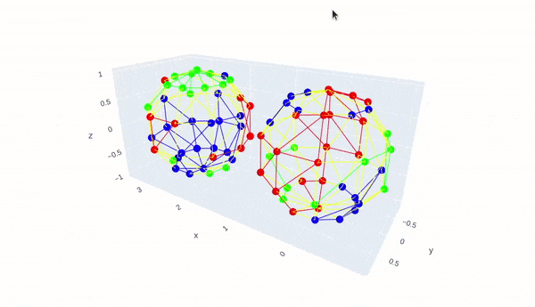

> **Note:** Steps to follow after cloning this repository is **mentioned in the end** above references section.

# Open3D-GSoD-2022-qualification-assignment

**Deadline:** May 06, 23:59 UTC / May 07, 05:29 AM IST



### Tasks

You’re expected to:

- [x] 1. Compile Open3D from source: http://www.open3d.org/docs/latest/compilation.html.

  <details open>
  <summary>Compilation steps</summary>
    <br>

    <h3>1. System specs</h3>

    <b>Note:</b> This is a CPU only machine from github codespaces.

    <pre>
    OS: Ubuntu 20.04.4 LTS (Focal Fossa)                # `cat /etc/os-release`
    gcc: gcc (Ubuntu 9.4.0-1ubuntu1~20.04.1) 9.4.0      # `gcc --version`
    clang: clang version 10.0.0-4ubuntu1                # `clang --version`
    cmake: cmake version 3.23.1                         # `cmake --verson` after following steps from `https://apt.kitware.com/` 
    CUDA: n/a
    ccache: ccache version 3.7.7                        # `ccache --version` after `sudo apt install ccache` (CPU Only)
    Python: 3.8.12                                      # `python --version`
    </pre>


    <h3>2. Setup</h3>
    
    A. Clone `git clone https://github.com/isl-org/Open3D`</br>
    B. Install dependencies `cd Open3D && util/install_deps_ubuntu.sh`</br>
    C. Config `mkdir build && cd build && sudo cmake ..`</br>
    D. Build `make -j$(nproc)` <b>(takes veryyy long time)</b></br>
    E. Install Open3d C++ lib `sudo make install`</br>
    F. Install Open3d Python lib `make install-pip-package`</br>
    E. Verify `python -c "import open3d; print(dir(open3d));"`</br>

    </br>
    </br>

  </details>

  <details open>
  <summary>Bind a dummy printing function to understand pybind</summary>
    <br>    

    <i>You may follow similar steps to add your own custom method</i>

    - Add `DummyMethod` *signature* in `./Open3D/cpp/open3d/geometry/TriangleMesh.h` file<br>
      ```c++
      // just like signature of `IsEdgeManifold` 
      // ---------------------------------------
      ...
      /// Function for testing how to use pybind
      bool DummyMethod(bool arg1 = true) const;
      ...
      ```
    - Add `DummyMethod` *definition* in `./Open3D/cpp/open3d/geometry/TriangleMesh.cpp`<br>
      ```c++
      // outside the TriangleMesh class just like `IsEdgeManifold`'s definition
      // ----------------------------------------------------------------------
      bool TriangleMesh::DummyMethod(
              bool arg1 /* = true */) const {
          // dummy function
          return true;
      }
      ```
    - Add `dummy_method` *binding* in `./Open3D/cpp/pybind/geometry/trianglemesh.cpp`<br> 
      ```c++
      // just like binding `is_edge_manifold`
      // -----------------------------------
      ...
      .def("dummy_method", &TriangleMesh::DummyMethod,
           "Dummy method to test pybinding.")
      ...

      ```
    - Run `cd build && sudo cmake .. && make -j$(nproc) && sudo make install && make install-pip-package` (there should be no c++ errors)<br>
    - Test in python interpreter<br>
      ```
      >>> import open3d as o3d
      >>> o3d.geometry.TriangleMesh().dummy_method(-1)
      True
      ```

  </details>

  <details open>

  <summary>Add Open3D</summary>
    <br>    

    **Note:** We are simply uploading the Open3D project folder and removing all tracking information by deleting the `.git` folder. A better way to add it is using submodules. But **not using submodules here because it is definitely an overkill!**

    > ### Add as submodule
    > 
    > Add Open3D project as a trackable project inside current project using
    > ```shell
    > git submodule add https://github.com/isl-org/Open3D
    > ```
    > 
    > ALternatively, you may also add Open3d in the main dir by simply cloning it but changes will not be tracked if done so.

  </details>


- [x] 2. Write C++ function `open3d::geometry::TriangleMesh::IdenticallyColoredConnectedComponents` and Python binding `open3d.geometry.TriangleMesh.identically_colored_connected_components`.
  <details open>
  <summary>My C++ is rusty so write and test/visualize in python first.</summary>
    <br>  
    There are three methods using which we can solve the problem:<br>
    
      1. Transform the graph into a new graph where only **edges with same colored vertices are connected** and then apply DFS<br/>
      2. Using laplacian matrix, eigen values and vectors<br/>
      3. (optimzed) Apply DFS without graph transformation.

    All Three of them are implemented in [core_logic.py](./core_logic.py) file along with visualisations using graph objects.<br>
    Solution `3.` is same as `1` but we make a minor change in DFS to make original graph appear as if it is the skipped new graph<br>

    ```python
    def dfs_custom(visited, graph, node, accumulator, vertex_colors):
        if node not in visited:
            accumulator.append(node)
            visited.add(node)
            for neighbour in graph[node]:
                if vertex_colors[node]!=vertex_colors[neighbour]:
                    continue
                dfs_custom(visited, graph, neighbour, accumulator, vertex_colors)
                
    def identically_colored_connected_compontents_dfs_optimized(adjacency_list, vertex_colors, debug=False):
        # convert to unique string ids (this step is not really required)
        for i in range(len(vertex_colors)):
            vertex_colors[i] = f'rgba({int(vertex_colors[i][0]*255)}, {int(vertex_colors[i][1]*255)}, {int(vertex_colors[i][2]*255)}, 255)'
        # note: no new graph
        # find connected components using DFS
        connected_components = []
        visited = set()
        for v in range(len(adjacency_list)):
            if v in visited:
                continue
            accumulator = []
            dfs_custom(visited, adjacency_list, v, accumulator, vertex_colors)
            connected_components.append(accumulator)
        return connected_components
    ```
    <br>

    ```shell
    $ python3 core_logic.py
    ```
    ```
    CASE 1:
    Connected components using DFS: ✅ Passed!
    Output: [[0, 3, 5, 6], [1, 4], [2]]
    Connected components using DFS (optimized): ✅ Passed!
    Output: [[0, 3, 5, 6], [1, 4], [2]]
    Connected components using Laplacian Matrix: ✅ Passed!
    Output: [[0, 3, 5, 6], [1, 4], [2]]

    CASE 2:
    Connected components using DFS: ✅ Passed!
    Output: [[0, 8, 9, 10, 19, 20, 21, 30, 40, 1, 41, 34, 24, 23, 13, 14, 5, 15, 29], [2, 11, 3, 4, 12], [6, 7], [16, 17, 18, 27, 25], [22, 32, 33, 31], [26, 35, 36, 37, 38, 28, 39], [42, 44, 53, 52, 63, 46, 55, 47, 48, 49, 50], [43, 74, 64, 65, 73, 72, 71, 81, 80, 82, 83, 62, 54, 76, 67, 58, 59, 77], [45], [51], [56, 57, 66], [60, 61, 70, 69, 68], [75], [78, 79]]
    Connected components using DFS (optimized): ✅ Passed!
    Output: [[0, 5, 14, 13, 23, 24, 34, 1, 40, 41, 30, 20, 10, 9, 8, 19, 29, 21, 15], [2, 3, 4, 12, 11], [6, 7], [16, 17, 18, 27, 25], [22, 32, 33, 31], [26, 35, 36, 37, 38, 39, 28], [42, 44, 53, 52, 63, 46, 47, 48, 49, 50, 55], [43, 74, 64, 65, 73, 72, 71, 80, 81, 82, 83, 62, 54, 76, 67, 77, 58, 59], [45], [51], [56, 66, 57], [60, 69, 68, 70, 61], [75], [78, 79]]
    Connected components using Laplacian Matrix: ❌ Failed! 0 appears more than once in connected components. There may be more such nodes.
    Output: [[0, 1, 2, 3, 4, 5, 6, 7, 8, 9, 10, 11, 12, 13, 14, 15, 16, 17, 18, 19, 20, 21, 22, 23, 24, 25, 26, 27, 28, 29, 30, 31, 32, 33, 34, 35, 36, 37, 38, 39, 40, 41], [0, 1, 2, 3, 4, 5, 6, 7, 8, 9, 10, 11, 12, 13, 14, 15, 16, 17, 18, 19, 20, 21, 22, 23, 24, 25, 26, 27, 28, 29, 30, 31, 32, 33, 34, 35, 36, 37, 38, 39, 40, 41], [0, 1, 2, 3, 4, 5, 6, 7, 8, 9, 10, 11, 12, 13, 14, 15, 16, 17, 18, 19, 20, 21, 22, 23, 24, 25, 26, 27, 28, 29, 30, 31, 32, 33, 34, 35, 36, 37, 38, 39, 40, 41], [0, 1, 2, 3, 4, 5, 6, 7, 8, 9, 10, 11, 12, 13, 14, 15, 16, 17, 18, 19, 20, 21, 22, 23, 24, 25, 26, 27, 28, 29, 30, 31, 32, 33, 34, 35, 36, 37, 38, 39, 40, 41], [0, 1, 2, 3, 4, 5, 6, 7, 8, 9, 10, 11, 12, 13, 14, 15, 16, 17, 18, 19, 20, 21, 22, 23, 24, 25, 26, 27, 28, 29, 30, 31, 32, 33, 34, 35, 36, 37, 38, 39, 40, 41], [0, 1, 2, 3, 4, 5, 6, 7, 8, 9, 10, 11, 12, 13, 14, 15, 16, 17, 18, 19, 20, 21, 22, 23, 24, 25, 26, 27, 28, 29, 30, 31, 32, 33, 34, 35, 36, 37, 38, 39, 40, 41], [42, 43, 44, 46, 47, 48, 49, 50, 52, 53, 54, 55, 58, 59, 62, 63, 64, 65, 67, 71, 72, 73, 74, 76, 77, 80, 81, 82, 83], [42, 43, 44, 46, 47, 48, 49, 50, 52, 53, 54, 55, 58, 59, 62, 63, 64, 65, 67, 71, 72, 73, 74, 76, 77, 80, 81, 82, 83], [42, 43, 44, 46, 47, 48, 49, 50, 52, 53, 54, 55, 56, 57, 58, 59, 60, 61, 62, 63, 64, 65, 66, 67, 68, 69, 70, 71, 72, 73, 74, 76, 77, 80, 81, 82, 83], [42, 43, 44, 46, 47, 48, 49, 50, 52, 53, 54, 55, 56, 57, 58, 59, 60, 61, 62, 63, 64, 65, 66, 67, 68, 69, 70, 71, 72, 73, 74, 76, 77, 80, 81, 82, 83], [78, 79], [45], [51], [75]]
    ```
    
    > - We won't follow laplacian method becuase it tricky due to precision issues. Moreover it has O(n^3) time complexity.
    > - Results of DFS algotithm are correct for both the meshes - `test_mesh.ply` and graph given in `assignment.pdf` 
  </details>
  <details open>
  <summary>Replicate algorithm in `Open3D-master`</summary>
    <br>  
    
    First, check how to access `vertices`, `vertex_colors` and `adjacency_list` within `./Open3D/cpp/open3d/geometry/TriangleMesh.cpp` and re-write python logic in C++.
    
    1. Add `IdenticallyColoredConnectedComponents` method signature in `./Open3D/cpp/open3d/geometry/TriangleMesh.h` <br>
    2. Add `IdenticallyColoredConnectedComponents` method definition in `./Open3D/cpp/open3d/geometry/TriangleMesh.cpp` <br>
    3. Add `identically_colored_connected_components` python binding in `./Open3D/cpp/pybind/geometry/trianglemesh.cpp` <br>
    4. Run `cd build && sudo cmake .. && make -j$(nproc) && sudo make install && make install-pip-package` <br>
    5. Test new method in C++ and Python 
    ```
    // python output
    [[0, 10, 20, 30, 40, 41, 1, 34, 24, 15, 5, 14, 23, 13, 21, 29, 19, 9, 8], [2, 12, 3, 4, 11], [6, 7], [16, 25, 17, 27, 18], [22, 32, 33, 31], [26, 36, 37, 28, 38, 39, 35], [42, 53, 63, 44, 52, 50, 49, 48, 47, 46, 55], [43, 83, 64, 74, 65, 73, 82, 72, 81, 71, 80, 62, 54, 77, 67, 76, 58, 59], [45], [51], [56, 66, 57], [60, 70, 61, 69, 68], [75], [78, 79]]
    
    // cpp output
    [[0, 8, 9, 10, 19, 20, 21, 30, 40, 1, 41, 34, 24, 23, 13, 14, 5, 15, 29], [2, 11, 3, 4, 12], [6, 7], [16, 17, 18, 27, 25], [22, 32, 33, 31], [26, 35, 36, 37, 38, 28, 39], [42, 44, 53, 52, 63, 46, 55, 47, 48, 49, 50], [43, 74, 64, 65, 73, 72, 71, 81, 80, 82, 83, 62, 54, 76, 67, 58, 59, 77], [45], [51], [56, 57, 66], [60, 61, 70, 69, 68], [75], [78, 79]]
    ```
    > May need ordering / sorting algorithm

    > ### Common issues
    > while running cpp file using `gcc examples/cpp/IdenticallyColoredConnectedComponents.cpp -lstdc++` error is raised -
    > ```
    > /usr/local/include/open3d/camera/PinholeCameraIntrinsic.h:29:10: fatal error: Eigen/Core: No such file or directory
    > ```
    > Solution is to run in shell:
    > ```
    > sudo apt-get install libeigen3-dev
    > sudo ln -s /usr/include/eigen3/Eigen /usr/include/Eigen
    > ```
    > 
    > similarly the ```sudo apt install libfmt-dev libglfw3-dev ```
  </details>
- [x] 3. Write `examples/python/solution.py` to read the input mesh `test_mesh.ply`, find identically-colored connected components and print results.

  <details open>
  <summary>How to run the example with python enviroment</summary>
    <br>
    
    Activate enviroment and run from main directory of Open3D:<br>
    ```shell
    $ source venv/bin/activate
    $ cd Open3D-master
    $ python3 examples/python/solution.py 
    ```
    Results will be generated in `examples/result.txt` like the one below for `test_mesh.ply`
    ```txt
    0	10	20	30	40	41	1	34	24	15	5	14	23	13	21	29	19	9	8	
    2	12	3	4	11	
    6	7	
    16	25	17	27	18	
    22	32	33	31	
    26	36	37	28	38	39	35	
    42	53	63	44	52	50	49	48	47	46	55	
    43	83	64	74	65	73	82	72	81	71	80	62	54	77	67	76	58	59	
    45	
    51	
    56	66	57	
    60	70	61	69	68	
    75	
    78	79	
    
    ```
  </details>
- [x] 4. Write Python unit test integrated with Open3D’s unit test system.

    > TODO: Put `test_mesh.ply` file inside assets directory.

    <br>

  <details open>
  <summary>Steps</summary>
    <br>

    - Make sure pytest is present in environment <br>
    
    - Add pytest compatible test in `Open3D-master/python/test/test_solution.py`. <br>
    
    - Run test using `python3 -m pytest python/test/test_solution.py` from `Open3D-master/` directory. 
    
    <br> 
  <details>

- [x] 5. Write `examples/cpp/Solution.cpp` to read the input mesh `test_mesh.ply`, find identically-colored connected components. **Change the build system** so that an executable can be build.
  <details open>
  <summary>How to run the example with cmake.</summary>
    <br>

    1. Write C++ code in `examples/cpp/Solution.cpp`.
    2. Add `open3d_add_example(Solution)` line in `Open3D-master/examples/cpp/CMakeLists.txt` to incorporate `Solution.cpp`
    3. Generate makefile by running `cd build && sudo cmake ..`
    4. Compile the solution by running `make Solution`. It will generate executable files inside `./bin/examples/`. 
    5. Goto `Open3D-master` and run `./build/bin/examples/Solution` (make sure .ply file exists in correct location as in `Solution.cpp`)
    6. Output will be generated at `examples/result.txt`
    
    ```
    0	10	20	30	40	41	1	34	24	15	5	14	23	13	21	29	19	9	8	
    2	12	3	4	11	
    6	7	
    16	25	17	27	18	
    22	32	33	31	
    26	36	37	28	38	39	35	
    42	53	63	44	52	50	49	48	47	46	55	
    43	83	64	74	65	73	82	72	81	71	80	62	54	77	67	76	58	59	
    45	
    51	
    56	66	57	
    60	70	61	69	68	
    75	
    78	79	

    ```

  <details>
  
- [x] 6. Write C+ unit test integrated with Open3D’s unit test system.
  <details open>
  <summary>How to create and run tests</summary>
    <br>
    
    - Add your tests in relevant place(s). For us, it is inside `cpp/tests/geometry/TriangleMesh.cpp`.
    - Generate Makefile for your tests: `cd build && sudo cmake -DBUILD_UNIT_TESTS=ON ..`
    - Compile your specific test: `make tests geometry TriangleMesh` (Errors will be displayed here in this step.)
    - Run executable: `./bin/tests`. 
    - To check your test, use grep: `./bin/tests | grep IdenticallyColoredConnectedComponents`

    ```
    [ RUN      ] TriangleMesh.IdenticallyColoredConnectedComponents
    [       OK ] TriangleMesh.IdenticallyColoredConnectedComponents (0 ms)
    ```

  </details>
- [x] 7. Document your code, the algorithm used, how to build and run, and etc.

  - All steps are mentioned in detail above 1-6 points (please expand the dropdown).
  - Small write up is present below.

---

# Brief Explanation

> **Note:** Everyting is done as expected except the un-ambigous ones. For example - sorting is not mentioned for connected components, guidlines on logic for unit-tests is not mentioned, where to store mesh files is not mentioned, what mesh files to use for unit tests is not mentioned.

<br>

First of all, make sure that your specs and dependencies match with mine. If not, you might get into some trouble. Follow the steps from 1 above. And make sure `plotly` is available in environment if you want to run [core_logic.py](./core_logic.py) for visualisation.

<br>

I am more of a pythonista compared to a C++ techie. So, first I made sure that I understand how pybind is integrated and if all compilations steps are working properly. Next, I needed the core logic for finding connected components written in C++. To make sure algorithm works, I tinkered with it in python - code available at [core_logic.py](./core_logic.py). This piece of code has logic for 3 different algorithms for the problem along with mesh-agnostic unit testing logic and some cool visualisations using plotly graph objects. The optimized DFS algorithm was implemented in C++ [Open3D-master/cpp/open3d/geometry/TriangleMesh.cpp](./Open3D-master/cpp/open3d/geometry/TriangleMesh.cpp).

<br>

> ### About the algorithm
> We convert mesh into a graph i.e adjacency list (can be computed using pre-defined `ComputeAdjacecyList`). Then we find all unique paths by traversing the graph only along edges that have same colored vertices at both ends. Tada! The vertices along these unique paths are our connected components. 
>
> See step 2.

<br>

Next, examples and unit tests are written for the core algorithm in both Python and C++. Because not much was mentioned by the organizing team, I took liberty to do this in different possible ways. In [python test](Open3D-master/python/test/test_solution.py), I read from complex graph [test_mesh.ply](./test_mesh.ply) and work on it but in C++ test we use simple graph as in [assignment.pdf](./assignment.pdf). But in [./Open3D-master/examples/cpp/Solution.cpp](./Open3D-master/examples/cpp/Solution.cpp) I showed how to read the complex grapg from [test_mesh.ply](./test_mesh.ply) for compensation. Many things can be improved here but I am not doing it becuase it is redundant - for example, writing unit test for both the cases (which I already checked in [core_logic.py](./core_logic.py)).

<br>

## Steps to follow once you clone the repository
<br>

1. Cone the repo `git clone https://github.com/INF800/Open3D-GSoD-2022-qualification-assignment`

2. Make sure you are using ubuntu and have gcc, clang, cmake, ccache and python matching the versions in step 1.

3. Install Open3d dependencies (press `Y` multiple times when prompted for.)
    ```shell
    $ cd Open3D-master
    $ util/install_deps_ubuntu.sh
    ```

4. Generate `Makefile` inside build directory (create if not exists.) along with unit tests.
    ```shell
    $ mkdir build
    $ cd build
    $ sudo cmake -DBUILD_UNIT_TESTS=ON ..
    ```
    You should see these 3 lines below the separator without any error messages.
    ```
    -- ================================================================================
    -- Configuring done
    -- Generating done
    -- Build files have been written to: /workspaces/Open3D-GSoD-2022-qualification-assignment/Open3D-master/build
    ```

5. Run C++ tests for TriangleMesh::IdenticallyColoredConnectedComponents.
    ```shell
    $ make tests 
    $ ./bin/tests | grep IdenticallyColoredConnectedComponents
    ```
    Wait. You should see `OK` in second line as shown below.
    ```
    [ RUN      ] TriangleMesh.IdenticallyColoredConnectedComponents
    [       OK ] TriangleMesh.IdenticallyColoredConnectedComponents (0 ms)
    ```
    You may wait or press `CTRL+C`.

6. Run C++ `examples/cpp/Solution.cpp`. Generate the executable file inside build folder and run it from main directory.
    ```
    $ make -j$(nproc)
    $ cd ..
    $ ./build/examples/Solution
    ```
    This will overwrite / create `Open3D-master/examples/result.txt`

7. Run Python test for `identically_colored_connected_components`
    ```
    $ cd build
    $ make -j$(nproc)
    $ make install-pip-package -j$(nproc)
    $ cd ..
    $ python3 -m pip install pytest
    $ pytest python/test/test_solution.py
    ```
    You should see
    ```
    python/test/test_solution.py ..                       [100%]

    =============== 2 passed in 1.69s ==========================
    ```
8. Run Python `examples/python/solution.py`
    ```
    $ python3  examples/python/solution.py
    ```
    This will overwrite / create `Open3D-master/examples/result.txt`

<br>
<br>

---

### References
Here are some links for your reference:

• Open3D repository: https://github.com/isl-org/Open3D. <br/>
• Open3D docs: http://www.open3d.org/docs. <br/>
• Pybind11: https://github.com/pybind/pybind11. <br/>
• Send an email to us. <br/>

### Submission

To submit your code:

1. Push the code to a private git repository, share the repository with us and ping us via email.<br/>
2. Include all the necessary files. The git history should indicate the files you changed.<br/>
